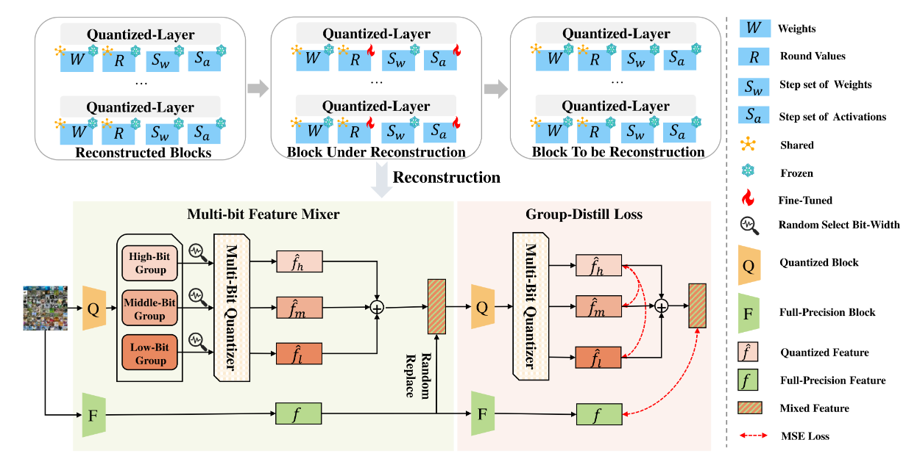

# ptmq-pytorch

PyTorch implementation of [**PTMQ: Post-training Multi-Bit Quantization of Neural Networks**]((https://ojs.aaai.org/index.php/AAAI/article/view/29553)), published in [AAAI 2024](https://aaai.org/conference/aaai/aaai-24/).

This paper finds that:

1. Multi-bit PTQ via block-wise reconstruction requires only minimal calibration data and achieves a 100x speed increase compared to recent multi-bit quantization methods.

2. Real-time bit-width adaptation is made possible through norm layer fusion. This capability addresses the limitation of previous methods that required re-optimization for bit-width changes.

3. A Multi-Bit Feature Mixer (MFM) fuses features across different bit-widths, which enhancing robustness and accuracy

4. A Group-wise Distillation Loss (GD-Loss)further strengthens feature correlation across bit-width groups, improving performance in both low-bit and high-bit scenarios.

<div align=center>
</img>
</div>

We quantize weights to a single bitwidth, and activations to 3 different bitwidths.

## Installation

We use `python3.10`, `torch`, `torchvision`, and `timm`. You can install the required packages using the following command:

```bash
pip install torch torchvision timm
```

## Getting Started

### Dataset

We use the ImageNet-1K dataset.

Calibration for post-training quantization uses a maximum of 1024 images, so we use the [mini-Imagenet dataset](https://www.kaggle.com/datasets/zcyzhchyu/mini-imagenet) for training data.

| Dataset    | Source                                                                           |
|------------|----------------------------------------------------------------------------------|
| Train Data | [mini-Imagenet](https://www.kaggle.com/datasets/zcyzhchyu/mini-imagenet) |
| Test Data  | [Official ImageNet-1K validation data](https://www.image-net.org/index.php)      |

### Model Support

All models stated in the paper are compatible with this implementation.

We use pretrained models from [`pytorch/vision`](https://github.com/pytorch/vision) and [`huggingface/pytorch-image-models`](https://github.com/huggingface/pytorch-image-models).

| Category                | Model                    | Variants                                                |
|-------------------------|--------------------------|---------------------------------------------------------|
| **CNNs**                | ResNet                   | ResNet-18, ResNet-34, ResNet-50, ResNet-101, ResNet-152 |
|                         | MobileNetV2              | -                                                       |
|                         | RegNetX                  | RegNetX-600MF                                           |
| **Vision Transformers** | ViT                      | ViT-S/224/16, ViT-B/224/16                              |
|                         | DeiT                     | DeiT-S/224/16, DeiT-B/224/16                            |

You can also add your own models by:

- adding the quantization block module to `utils/model_utils.py`
- creating a new config file for the model in the `configs` directory

### Run

#### Pretrained Baselines

Get replicated results using the pretrained models and baselines.

#### Post-Training Quantization - From Scratch

```bash
python run_ptmq.py --config configs/[config_file].yaml
```

Create your own configuration file in the `configs` directory.

## Results

We replicate the results, without using mixed-precision quantization.

### PTMQ on CNNs - Results

| Model         | Benchmark       | W3A3  | W4A4  | W6A6  | W8A8  | FP32  |
|---------------|-----------------|-------|-------|-------|-------|-------|
| ResNet-18     | PTMQ (Paper)    | 64.92 | 67.57 | 70.23 | 70.79 | 71.00 |
|               | PTMQ (Our Code) |   -   |   -   |   -   |   -   | 69.76 |
| ResNet-50     | PTMQ (Paper)    | 69.67 | 73.93 | 76.11 | 76.52 | 76.80 |
|               | PTMQ (Our Code) |   -   |   -   |   -   |   -   | -     |
| RegNetX-600MF | PTMQ (Paper)    | 59.29 | 68.84 | 72.85 | 73.32 | 73.50 |
|               | PTMQ (Our Code) |   -   |   -   |   -   |   -   | -     |
| MobileNet-V2  | PTMQ (Paper)    |   -   | 64.94 | 70.00 | 72.05 | 72.40 |
|               | PTMQ (Our Code) |   -   |   -   |   -   |   -   | -     |

```bash
python run_ptmq.py --config configs/ptmq_resnet18_w3a3.yaml
```

Loss curves for each model are shown below:

### PTMQ on Vision Transformers - Results

| Model         | Benchmark       | W4A6  | W5A6  | W6A6  | W7A7  | W8A8  | FP32  |
|---------------|-----------------|-------|-------|-------|-------|-------|-------|
| ViT-S/224/16  | PTMQ (Paper)    | 71.67 | 75.14 | 76.09 | 77.14 | 78.16 | -     |
|               | PTMQ (Our Code) | -     | -     | -     | -     | -     | -     |
| ViT-B/224/16  | PTMQ (Paper)    | 75.00 | 76.64 | 77.70 | 78.62 | 79.12 | -     |
|               | PTMQ (Our Code) | -     | -     | -     | -     | -     | -     |
| DeiT-S/224/16 | PTMQ (Paper)    | 77.20 | 78.24 | 78.74 | 79.30 | 79.53 | -     |
|               | PTMQ (Our Code) | -     | -     | -     | -     | -     | -     |
| DeiT-B/224/16 | PTMQ (Paper)    | 80.00 | 80.62 | 80.81 | 81.35 | 81.54 | -     |
|               | PTMQ (Our Code) | -     | -     | -     | -     | -     | -     |

Loss curves for each model are shown below:

## Project Structure (TODO)

```bash
├── configs/                # Configuration files for models
│   ├── deit/               # configs for DeiT models
│   ├── mobilenet/          # configs for MobileNetV2 models
│   ├── regnetx/            # configs for RegNetX models
│   ├── resnet/             # configs for ResNet models
│   ├── vit/                # configs for ViT models
├── data/                   # Data directory
│   ├── mini-imagenet/      # mini-imagenet dataset
│   └── imagenet/           # imagenet-1k dataset
├── quant/                  # Quantization functions
│   ├── fake_quant.py
│   ├── observer.py
│   ├── quant_func.py
│   ├── quant_module.py
│   ├── quant_state.py
├── utils/                  # Utility functions
│   ├── eval_utils.py       # Model utility functions
│   ├── fold_bn.py
│   ├── model_utils.py
│   └── ptmq_recon.py
├── weights/                # Weights for models that are PTMQ-ifed
├── run_ptmq.py             # Main script for running PTMQ
└── README.md               
```

## Tips

- Using the `MSEObserver` can be time-consuming, and using the `MinMaxObserver` can speed up calibration
- Since we do not use mixed-precision quantization, post-training quantization is faster
- Make sure to use the correct transforms for each model (e.g. `timm`-based models have specific transforms)
- Authors have not explicitly stated how to set low/mid/high bit-precision for mixed-precision quantization. We assume that they use the best configs possible for each bit-precision
  - ex) if we want W4A6, we assume that low=6, mid=7, high=8 (so maximal performance is achieved)

## References

- The [PTMQ paper](https://ojs.aaai.org/index.php/AAAI/article/view/29553)
- Source code for for [QDrop](https://github.com/wimh966/QDrop)

## Citation

If you find this code useful, please cite the following:

```
@misc{Chong2024PTMQ,
  author = {Chong, Hyochan},
  title = {pytorch-ptmq},
  year = {2024},
  publisher = {GitHub},
  journal = {GitHub repository},
  howpublished = {\url{https://github.com/d7chong/ptmq-pytorch}},
}
```


## License

[](https://github.com/d7chong/ptmq-pytorch/blob/master/LICENSE)